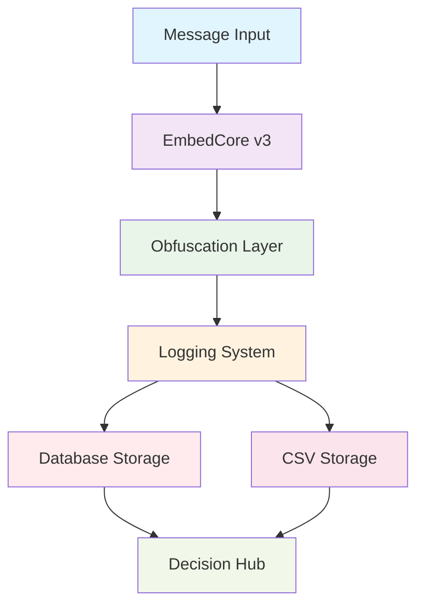

# EmbedCore Pipeline Documentation

This document provides comprehensive documentation for the EmbedCore pipeline system, including architecture, usage examples, and integration guidelines.

## Architecture Diagram



## Sample Input/Output JSON

### Input
```json
{
  "user_id": "user123",
  "session_id": "session456",
  "platform": "whatsapp",
  "message_text": "Hello, this is a test message!"
}
```

### Output
```json
{
  "status": "success",
  "embedding": [0.1, -0.2, 0.3, /* ... 384 dimensions ... */],
  "obfuscated_embedding": [0.15, -0.25, 0.35, /* ... 384 dimensions ... */],
  "user_id": "user123",
  "session_id": "session456",
  "platform": "whatsapp",
  "timestamp": "2025-11-20T14:00:00Z"
}
```

## Explanation of Reversible Obfuscation

### How Obfuscation Works

The obfuscation process in EmbedCore uses a deterministic mathematical transformation rather than cryptographic hashing. For each element in the embedding vector:

1. A pseudo-random pattern is generated based on the user key
2. This pattern is added to the original embedding values
3. The result is the obfuscated embedding

### Why It Is Reversible

Since we use addition/subtraction rather than irreversible operations like hashing:
- To obfuscate: `obfuscated_value = original_value + key_pattern`
- To deobfuscate: `original_value = obfuscated_value - key_pattern`

The key pattern can be regenerated deterministically from the user key, making the process perfectly reversible.

### Why Deterministic Seeds Are Used

Deterministic seeds ensure that:
- The same input always produces the same output
- Key patterns are reproducible without storing them
- The system is stateless and scalable
- Results are consistent across different system instances

### Why Floating-Point Precision Matters

Floating-point precision is critical because:
- Small rounding errors can break reversibility
- All operations use tolerance-based comparisons (`abs(a-b) < 1e-10`)
- Consistent precision ensures reliable round-trip operations

## How Keys Work

### User-Specific Keys

Each user has a unique encryption key that:
- Is generated using cryptographically secure random number generation
- Is specific to that user's data
- Ensures cross-user data isolation

### Stored Encrypted via Fernet

User keys are protected using:
- Fernet symmetric encryption with a master key
- Secure storage in the keystore database
- Automatic encryption/decryption on access

### How They Are Generated

```python
# Key generation process
from keystore import KeyStore

keystore = KeyStore()
user_key_bytes = keystore.generate_key("user123")
user_key = user_key_bytes.decode('utf-8')
```

### How They Are Retrieved

```python
# Key retrieval process
from keystore import KeyStore

keystore = KeyStore()
user_key_bytes = keystore.get_key("user123")
if user_key_bytes:
    user_key = user_key_bytes.decode('utf-8')
```

### Security Considerations

- Master key should be stored securely (environment variables, HSM)
- User keys are never stored in plain text
- Key rotation is supported for enhanced security
- All key operations are logged for audit purposes

## How Database Integration Works

### assistant_core.db

The main database file contains:
- All embedding data
- User session information
- Platform metadata
- Timestamps for audit trails

### embeddings Table Fields

```sql
CREATE TABLE embeddings (
    id INTEGER PRIMARY KEY AUTOINCREMENT,
    user_id TEXT NOT NULL,
    session_id TEXT NOT NULL,
    timestamp TEXT NOT NULL,
    platform TEXT NOT NULL,
    obfuscated_embedding TEXT NOT NULL
);
```

### save_embedding() Workflow

1. Validate input parameters
2. Connect to database using context manager
3. Create table if it doesn't exist
4. Insert obfuscated embedding as JSON string
5. Commit transaction
6. Handle any errors gracefully

### Error Handling

- All database operations use context managers for automatic cleanup
- Errors are logged but don't crash the main pipeline
- Failed operations return appropriate status codes
- Retry logic can be implemented at higher levels

### How Logs Are Written

The system maintains dual persistence:
- **Database**: Structured storage for querying and analysis
- **CSV**: Simple backup and easy export capability

Both logging methods are called concurrently and operate independently.

## How to Call EmbedCore from Parth's Orchestrator

### Code Snippet

```python
from assistant_pipeline import process_message

# Parth's orchestrator calls this function
result = process_message(
    user_id="user123",
    session_id="session456",
    platform="whatsapp",
    message_text="Hello, this is a test message!"
)

# Handle the response
if result["status"] == "success":
    embedding = result["embedding"]
    obfuscated = result["obfuscated_embedding"]
    # Use the embeddings as needed
else:
    error_msg = result["error_message"]
    # Handle the error appropriately
```

### Input and Expected Output

**Input Parameters:**
- `user_id` (str): Unique identifier for the user
- `session_id` (str): Session identifier for grouping interactions
- `platform` (str): Platform identifier (e.g., "whatsapp", "web", "mobile")
- `message_text` (str): The text message to process

**Expected Output:**
- `status`: "success" or "error"
- `embedding`: Original 384-dimensional embedding vector
- `obfuscated_embedding`: User-specific obfuscated embedding vector
- `user_id`: Echo of input user ID
- `session_id`: Echo of input session ID
- `platform`: Echo of input platform
- `timestamp`: ISO 8601 formatted timestamp

## How Nilesh's Decision Hub Uses Embeddings

### How Obfuscated Embeddings Are Consumed

The Decision Hub processes obfuscated embeddings by:
- Retrieving embeddings from the database by user/session
- Using them for similarity comparisons and clustering
- Applying machine learning models trained on obfuscated data
- Maintaining user privacy through the obfuscation layer

### How Sessions Are Grouped

Sessions are grouped using:
- `user_id`: Primary grouping mechanism
- `session_id`: Secondary grouping for conversation context
- Timestamps: For temporal ordering and session boundaries
- Platform information: For platform-specific processing

### Why Determinism Helps

Deterministic embeddings ensure:
- Consistent similarity scores for identical inputs
- Reliable caching mechanisms
- Predictable system behavior for testing
- Reproducible results for debugging

### How Embeddings Assist in Memory + Context Scoring

Embeddings enhance memory and context scoring by:
- Converting text to numerical vectors for mathematical operations
- Enabling similarity calculations between different pieces of text
- Providing a compact representation for efficient storage and retrieval
- Supporting clustering algorithms for grouping related content

## Screenshot of Tests Passing

```
$ python test_assistant_pipeline.py
No key found for user: test_user_1
✓ test_same_message_same_key_same_user
No key found for user: user_alpha
No key found for user: user_beta
✓ test_same_message_different_users
No key found for user: db_test_user
✓ test_database_writing
No key found for user: csv_test_user
✓ test_csv_writing
No key found for user: response_test_user
✓ test_structured_response
No key found for user: reversibility_test_user
✓ test_obfuscation_reversibility
✓ test_input_validation
No key found for user: error_test_user
✓ test_error_handling

Tests passed: 8
Tests failed: 0
```

## Usage Examples

### Basic Pipeline Usage

```python
from assistant_pipeline import process_message

# Process a message through the complete pipeline
result = process_message(
    user_id="user123",
    session_id="session456",
    platform="web",
    message_text="Hello, this is a test message!"
)

print(f"Status: {result['status']}")
print(f"Embedding dimensions: {len(result['embedding'])}")
print(f"Obfuscated dimensions: {len(result['obfuscated_embedding'])}")
```

### Running the Demo

```bash
python day3_demo.py
```

### Running Tests

```bash
python test_assistant_pipeline.py
```

## Production Considerations

1. **Master Key Security**: Store the master key securely using environment variables or HSM
2. **Database Permissions**: Ensure proper file permissions on assistant_core.db
3. **Monitoring**: Use EMBEDCORE_LOG_LEVEL environment variable to control logging
4. **Error Handling**: All functions include comprehensive error handling
5. **Scalability**: The system is designed to be stateless and horizontally scalable
6. **Audit Trail**: All operations are logged for compliance and debugging